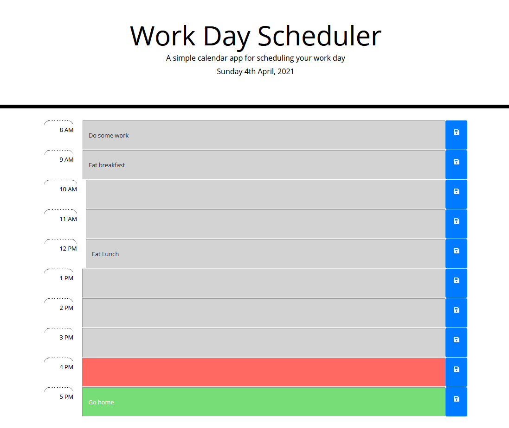

# Work Day Scheduler - HW05

## Description

For this assignment I had to use JavaScript frameworks such as Moment (for the live date and hour format), and jQuery. Moment was used at the top of the page where the current date is displayed and will change in real time. It was also used to add AM and PM to the time blocks. The time blocks were created using jQuery and template strings, so that when the page loads, the times and inputs are dynamically created and the colours of the inputs are dependant on the time. This also ties into how data from local storage will be inputted into those inputs every time the page is refreshed. You can use the 'Save' button to save the input into local storage.

I also used bootstrap to style the buttons, and I used font awesome icons to have the save icon inside of the button.

## Screenshots

Inputted data in the schedule:

(GitHub is broken and not showing the image sometimes, so please go to the assets folder.)

## Project Github Pages Link

[Deployed GitHub Pages Site](https://leon3005.github.io/Work_Day_Scheduler/)

## Contact

Please report any bugs to [my email](mailto:leonwheeler08@gmail.com) 😀
